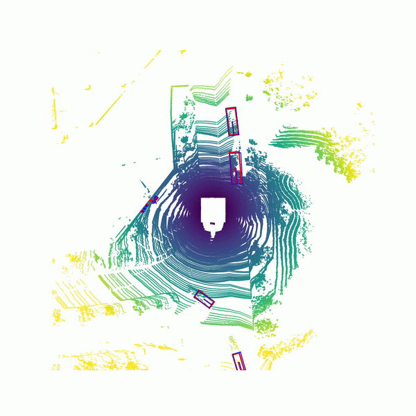

# Center-based 3D Object Detection and Tracking

3D Object Detection and Tracking using center points in the bird-eye view.

<p align="center">  </p>

> [**Center-based 3D Object Detection and Tracking**](https://arxiv.org/abs/2006.11275),            
> Tianwei Yin, Xingyi Zhou, Philipp Kr&auml;henb&uuml;hl,        
> *arXiv technical report ([arXiv 2006.11275](https://arxiv.org/abs/2006.11275))*  


    @article{yin2020center,
      title={Center-based 3D Object Detection and Tracking},
      author={Yin, Tianwei and Zhou, Xingyi and Kr{\"a}henb{\"u}hl, Philipp},
      journal={arXiv:2006.11275},
      year={2020},
    }

## Updates

[2020-12-11] **NEW:** 3 out of the top 4 entries in the recent NeurIPS 2020 nuScenes 3D Detection challenge used CenterPoint. Congratualations to other participants and please stay tuned for more updates on nuScenes and Waymo soon. 

[2020-08-10] We now support vehicle detection on [Waymo](docs/WAYMO.md) with SOTA performance. Please stay tuned for more updates in the fall. 

## Contact
Any questions or discussion are welcome! 

Tianwei Yin [yintianwei@utexas.edu](mailto:yintianwei@utexas.edu) 
Xingyi Zhou [zhouxy@cs.utexas.edu](mailto:zhouxy@cs.utexas.edu)

## Abstract
Three-dimensional objects are commonly represented as 3D boxes in a point-cloud. This representation mimics the well-studied image-based 2D bounding-box detection, but comes with additional challenges. Objects in a 3D world do not follow any particular orientation, and box-based detectors have difficulties enumerating all orientations or fitting an axis-aligned bounding box to rotated objects. In this paper, we instead propose to represent, detect, and track 3D objectsas points. We use a keypoint detector to find centers of objects, and simply regress to other attributes, including 3D size, 3D orientation, and velocity. In our center-based framework, 3D object tracking simplifies to greedy closest-point matching.The resulting detection and tracking algorithm is simple, efficient, and effective. On the nuScenes dataset, our point-based representations performs 3-4mAP higher than the box-based counterparts for 3D detection, and 6 AMOTA higher for 3D tracking. Our real-time model runs end-to-end 3D detection and tracking at 30 FPS with 54.2AMOTA and 48.3mAP while the best single model achieves 60.3mAP for 3D detection, and 63.8AMOTA for 3D tracking. 

# Highlights

- **Simple:** Two sentences method summary: We use standard 3D point cloud encoder with a few convolutional layers in the head to produce a bird-eye-view heatmap and other dense regression outputs including the offset to centers in the previous frame. Detection is a simple local peak extraction, and tracking is a closest-distance matching.

- **Fast:** Our [PointPillars model](configs/centerpoint/nusc_centerpoint_pp_02voxel_circle_nms.py) runs at *30* FPS with *48.3* AP and *59.1* AMOTA for simultaneous 3D detection and tracking on the nuScenes dataset. 

- **Accurate**: Our [best single model](configs/centerpoint/nusc_centerpoint_voxelnet_dcn_0075voxel_flip_testset.py) achieves *60.3* mAP and *67.3* NDS on nuScenes detection testset.

- **Extensible**: Simple baseline to switch in your backbone and novel algorithms.

## Main results

#### 3D detection

|         |  Split  |  MAP    |  NDS   |  FPS  |
|---------|---------|---------|--------|-------|
| PointPillars-512  |  Val    |  48.3   |  59.1  |  30.3 |   
| VoxelNet-1024  |  Val    |  55.4   |  63.8  |  14.5 |    
| VoxelNet-1440_dcn_flip  |  Val    |  59.1  |  67.1   | 2.2 |
| VoxelNet-1440_dcn_flip   |  Test   |  60.3  |  67.3  | 2.2 |  

#### 3D Tracking

|                       | Split     | Tracking time | Total time   | AMOTA ↑ | AMOTP ↓ |
|-----------------------|-----------|---------------|--------------|---------|---------|
| CenterPoint_pillar_512| val  | 1ms | 34ms | 54.2 | 0.680 |
| CenterPoint_voxel_1024| val  | 1ms | 70ms | 62.6 | 0.630 |
| CenterPoint_voxel_1440_dcn_flip | val | 1ms | 451ms | 65.9 | 0.567 |
| CenterPoint_voxel_1440_dcn_flip | test | 1ms | 451ms | 63.8 | 0.555 |

All results are tested on a Titan Xp GPU with batch size 1. More models and details can be found in [MODEL_ZOO.md](docs/MODEL_ZOO.md).

## Third-party resources

- [AFDet](https://arxiv.org/abs/2006.12671): another work inspired by CenterNet achieves good performance on KITTI/Waymo dataset. 

## Use CenterPoint

We provide a demo with PointPillars model for 3D object detection on the nuScenes dataset. 

### Basic Installation

```bash
# basic python libraries
conda create --name centerpoint python=3.6
conda activate centerpoint
conda install pytorch==1.1.0 torchvision==0.3.0 cudatoolkit=10.0 -c pytorch
git clone https://github.com/tianweiy/CenterPoint.git
cd CenterPoint
pip install -r requirements.txt

# add CenterPoint to PYTHONPATH by adding the following line to ~/.bashrc (change the path accordingly)
export PYTHONPATH="${PYTHONPATH}:PATH_TO_CENTERPOINT"
```

First download the model (By default, [centerpoint_pillar_512](https://drive.google.com/file/d/1ubWKx3Jg1AqF93qqWIZxgGXTycQ77qM3/view?usp=sharing)) from the [Model Zoo](docs/MODEL_ZOO.md) and put it in ```work_dirs/centerpoint_pillar_512_demo```. 

We provide a driving sequence clip from the [nuScenes dataset](https://www.nuscenes.org). Donwload the [folder](https://drive.google.com/file/d/1bK-xeq5UwJzpPfVDhICDJeKiU1QVZwtI/view?usp=sharing) and put in the main directory.     
Then run a demo by ```python tools/demo.py```. If setup corectly, you will see an output video like (red is gt objects, blue is the prediction): 

<p align="center">  </p> 

## Advanced Installation  

For more advanced usage, please refer to [INSTALL](docs/INSTALL.md) to set up more libraries needed for distributed training and sparse convolution.

## Benchmark Evaluation and Training 

Please refer to [GETTING_START](docs/GETTING_START.md) to prepare the data. Then follow the instruction there to reproduce our detection and tracking results. All detection configurations are included in [configs](configs) and we provide the scripts for all tracking experiments in [tracking_scripts](tracking_scripts). The pretrained models, log, and each model's prediction files are provided in the [MODEL_ZOO.md](docs/MODEL_ZOO.md). 


## License

CenterPoint is release under MIT license (see [LICENSE](LICENSE)). It is developed based on a forked version of [det3d](https://github.com/poodarchu/Det3D/tree/56402d4761a5b73acd23080f537599b0888cce07). We also incorperate a large amount of code from [CenterNet](https://github.com/xingyizhou/CenterNet)
and [CenterTrack](https://github.com/xingyizhou/CenterTrack). See the [NOTICE](docs/NOTICE) for details. Note that the nuScenes dataset is free of charge for non-commercial activities. Please contact the [nuScenes team](https://www.nuscenes.org) for commercial usage. 

## Acknowlegement
This project is not possible without multiple great opensourced codebases. We list some notable examples below.  

* [det3d](https://github.com/poodarchu/det3d)
* [second.pytorch](https://github.com/traveller59/second.pytorch)
* [CenterTrack](https://github.com/xingyizhou/CenterTrack)
* [CenterNet](https://github.com/xingyizhou/CenterNet) 
* [mmcv](https://github.com/open-mmlab/mmcv)
* [mmdetection](https://github.com/open-mmlab/mmdetection)
* [maskrcnn_benchmark](https://github.com/facebookresearch/maskrcnn-benchmark)
* [PCDet](https://github.com/sshaoshuai/PCDet)

**CenterPoint is deeply influenced by the following projects. Please consider citing the relevant papers.**

```
@article{zhu2019classbalanced,
  title={Class-balanced Grouping and Sampling for Point Cloud 3D Object Detection},
  author={Zhu, Benjin and Jiang, Zhengkai and Zhou, Xiangxin and Li, Zeming and Yu, Gang},
  journal={arXiv:1908.09492},
  year={2019}
}

@article{lang2019pillar,
   title={PointPillars: Fast Encoders for Object Detection From Point Clouds},
   journal={CVPR},
   author={Lang, Alex H. and Vora, Sourabh and Caesar, Holger and Zhou, Lubing and Yang, Jiong and Beijbom, Oscar},
   year={2019},
}

@article{zhou2018voxelnet,
   title={VoxelNet: End-to-End Learning for Point Cloud Based 3D Object Detection},
   journal={CVPR},
   author={Zhou, Yin and Tuzel, Oncel},
   year={2018},
}

@article{yan2018second,
  title={Second: Sparsely embedded convolutional detection},
  author={Yan, Yan and Mao, Yuxing and Li, Bo},
  journal={Sensors},
  year={2018},
}

@article{zhou2019objects,
  title={Objects as Points},
  author={Zhou, Xingyi and Wang, Dequan and Kr{\"a}henb{\"u}hl, Philipp},
  journal={arXiv:1904.07850},
  year={2019}
}

@article{zhou2020tracking,
  title={Tracking Objects as Points},
  author={Zhou, Xingyi and Koltun, Vladlen and Kr{\"a}henb{\"u}hl, Philipp},
  journal={arXiv:2004.01177},
  year={2020}
}
```
