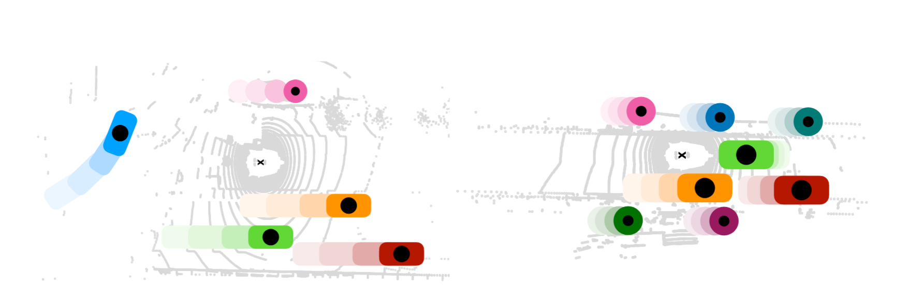

# Center-based 3D Object Detection and Tracking

3D Object Detection and Tracking using center points in the bird-eye view.

  

> [**Center-based 3D Object Detection and Tracking**](https://arxiv.org/abs/2006.11275),            
> Tianwei Yin, Xingyi Zhou, Philipp Kr&auml;henb&uuml;hl,        
> *arXiv technical report ([arXiv 2006.11275](https://arxiv.org/abs/2006.11275))*  

    @article{yin2021center,
      title={Center-based 3D Object Detection and Tracking},
      author={Yin, Tianwei and Zhou, Xingyi and Kr{\"a}henb{\"u}hl, Philipp},
      journal={CVPR},
      year={2021},
    }

## NEWS

[2021-12-27] We release a multimodal fusion approach for 3D detection [MVP](https://github.com/tianweiy/MVP). More research to come in Spring 2022.

[2021-12-27] A TensorRT implementation (by [Wang Hao](https://github.com/Abraham423)) of CenterPoint-PointPillar is available at [URL](https://github.com/Abraham423/CenterPointTensorRT). ~60 FPS on Waymo Open Dataset. There is also a nice onnx conversion [repo](https://github.com/CarkusL/CenterPoint) by [CarkusL](https://github.com/CarkusL).   

[2021-06-20] The real time version of CenterPoint ranked 2nd in the Waymo Real-time 3D detection challenge (72.8 mAPH / 57.1 ms). The corresponding techical report is available at [URL](https://drive.google.com/file/d/1wG1zPc2PyWgBIC-dLSFbxzeZ3FhA708_/view). Code is at [URL](https://github.com/tianweiy/CenterPoint/tree/new_release)

[2021-04-13] Better nuScenes results by fixing sync-bn bug and using stronger augmentations. Plese refer to [nuScenes](configs/nusc/README.md).  

[2021-02-28] CenterPoint is accepted at CVPR 2021 :fire:

[2021-01-06] CenterPoint v0.1 is released. Without bells and whistles, we rank first among all Lidar-only methods on Waymo Open Dataset with a single model. Check out CenterPoint's model zoo for [Waymo](configs/waymo/README.md) and [nuScenes](configs/nusc/README.md). 

## Contact
Any questions or suggestions are welcome! 

Tianwei Yin [yintianwei@utexas.edu](mailto:yintianwei@utexas.edu) 
Xingyi Zhou [zhouxy@cs.utexas.edu](mailto:zhouxy@cs.utexas.edu)

## Abstract
Three-dimensional objects are commonly represented as 3D boxes in a point-cloud. This representation mimics the well-studied image-based 2D bounding-box detection but comes with additional challenges. Objects in a 3D world do not follow any particular orientation, and box-based detectors have difficulties enumerating all orientations or fitting an axis-aligned bounding box to rotated objects. In this paper, we instead propose to represent, detect, and track 3D objects as points. Our framework, CenterPoint, first detects centers of objects using a keypoint detector and regresses to other attributes, including 3D size, 3D orientation, and velocity. In a second stage, it refines these estimates using additional point features on the object. In CenterPoint, 3D object tracking simplifies to greedy closest-point matching. The resulting detection and tracking algorithm is simple, efficient, and effective. CenterPoint achieved state-of-the-art performance on the nuScenes benchmark for both 3D detection and tracking, with 65.5 NDS and 63.8 AMOTA for a single model. On the Waymo Open Dataset, CenterPoint outperforms all previous single model method by a large margin and ranks first among all Lidar-only submissions.

# Highlights

- **Simple:** Two sentences method summary: We use standard 3D point cloud encoder with a few convolutional layers in the head to produce a bird-eye-view heatmap and other dense regression outputs including the offset to centers in the previous frame. Detection is a simple local peak extraction with refinement, and tracking is a closest-distance matching.

- **Fast and Accurate**: Our best single model achieves *71.9* mAPH on Waymo and *65.5* NDS on nuScenes while running at 11FPS+. 

- **Extensible**: Simple replacement for anchor-based detector in your novel algorithms.

## Main results

#### 3D detection on Waymo test set

|         |  #Frame | Veh_L2 | Ped_L2 | Cyc_L2  | MAPH   |  FPS  |
|---------|---------|--------|--------|---------|--------|-------|
|VoxelNet | 1       |  71.9     |  67.0      |  68.2       |   69.0     |   13    | 
|VoxelNet | 2       |  73.0     |  71.5      |  71.3       |   71.9     |  11     |

#### 3D detection on Waymo domain adaptation test set

|         |  #Frame | Veh_L2 | Ped_L2 | Cyc_L2  | MAPH   |  FPS  |
|---------|---------|--------|--------|---------|--------|-------|
|VoxelNet | 2       |  56.1     |  47.8      |  65.2      |   56.3     |  11   |

#### 3D detection on nuScenes test set 

|         |  MAP ↑  | NDS ↑  | PKL ↓  | FPS ↑|
|---------|---------|--------|--------|------|
|VoxelNet |  58.0   | 65.5   | 0.69   | 11 |    

#### 3D tracking on Waymo test set 

|         |  #Frame | Veh_L2 | Ped_L2 | Cyc_L2  | MOTA   |  FPS  |
|---------|---------|--------|--------|---------|--------|-------|
| VoxelNet| 2       |   59.4     |  56.6      |   60.0      | 58.7       |  11    | 

#### 3D Tracking on nuScenes test set 

|          | AMOTA ↑ | AMOTP ↓ |
|----------|---------|---------|
| VoxelNet (flip test) |   63.8      |  0.555       |       

All results are tested on a Titan RTX GPU with batch size 1.

## Third-party resources

- [ONCE_Benchmark](https://github.com/PointsCoder/ONCE_Benchmark): Implementation of CenterPoint on the ONCE dataset 
- [CenterPoint-KITTI](https://github.com/tianweiy/CenterPoint-KITTI): Reimplementation of CenterPoint on the KITTI dataset 
- [OpenPCDet](https://github.com/open-mmlab/OpenPCDet): Implementation of CenterPoint in OpenPCDet framework (with configs for Waymo dataset)
- [AFDet](https://arxiv.org/abs/2006.12671): another work inspired by CenterNet achieves good performance on KITTI/Waymo dataset
- [mmdetection3d](https://github.com/open-mmlab/mmdetection3d/tree/master/configs/centerpoint): CenterPoint in mmdet framework
- [CenterPointTensorRT](https://github.com/Abraham423/CenterPointTensorRT): CenterPoint-PointPillar for accelerated inference with TensorRT 
- [CenterPoint-ONNX](https://github.com/CarkusL/CenterPoint): Convert CenterPoint-Pillar to ONNX / TensorRT

## Use CenterPoint

### Installation

Please refer to [INSTALL](docs/INSTALL.md) to set up libraries needed for distributed training and sparse convolution.

### Benchmark Evaluation and Training 

Please refer to [GETTING_START](docs/GETTING_START.md) to prepare the data. Then follow the instruction there to reproduce our detection and tracking results. All detection configurations are included in [configs](configs).

### Develop

If you are interested in training CenterPoint on a new dataset, use CenterPoint in a new task, or use a new network architecture for CenterPoint, please refer to [DEVELOP](docs/DEVELOP.md). Feel free to send us an email for discussions or suggestions. 

### ToDo List
- [ ] Support visualization with Open3D  
- [ ] Colab demo 
- [ ] Docker   

## License

CenterPoint is release under MIT license (see [LICENSE](LICENSE)). It is developed based on a forked version of [det3d](https://github.com/poodarchu/Det3D/tree/56402d4761a5b73acd23080f537599b0888cce07). We also incorperate a large amount of code from [CenterNet](https://github.com/xingyizhou/CenterNet)
and [CenterTrack](https://github.com/xingyizhou/CenterTrack). See the [NOTICE](docs/NOTICE) for details. Note that both nuScenes and Waymo datasets are under non-commercial licenses. 

## Acknowlegement
This project is not possible without multiple great opensourced codebases. We list some notable examples below.  

* [det3d](https://github.com/poodarchu/det3d)
* [second.pytorch](https://github.com/traveller59/second.pytorch)
* [CenterTrack](https://github.com/xingyizhou/CenterTrack)
* [CenterNet](https://github.com/xingyizhou/CenterNet) 
* [mmcv](https://github.com/open-mmlab/mmcv)
* [mmdetection](https://github.com/open-mmlab/mmdetection)
* [OpenPCDet](https://github.com/open-mmlab/OpenPCDet)
